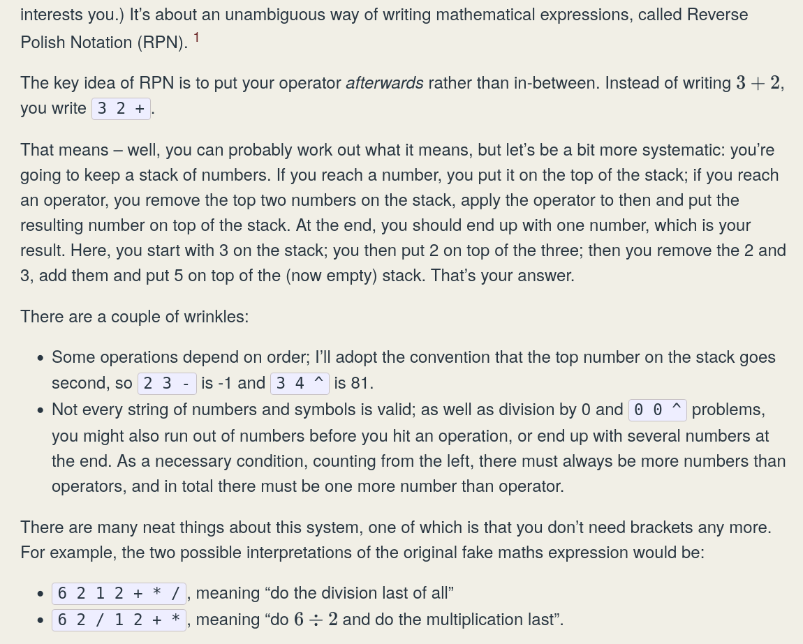

## Reverse Polish Notation

It is fun to know math expressions can be written without brackets!

The task at hand is to make a partial calculator that takes an inverted Polish math expression as input and outputs the result, or error. 
The stack container is built for this.

The subject gives usage examples such as:

```
$> ./RPN "8 9 * 9 - 9 - 9 - 4 - 1 +"
42
```

```
$> ./RPN "7 7 * 7 -"
42
```

But a RPN calculator might freely take in also:

```
$> ./RPN "2 3 4 + *"
14
```
```
$> ./RPN "6 2 1 2 + * /"
1
```


I will not attempt to explain RPN better than this https://www.flyingcoloursmaths.co.uk/reverse-polish-notation/


