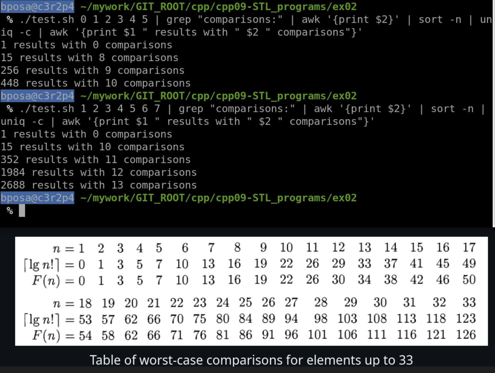
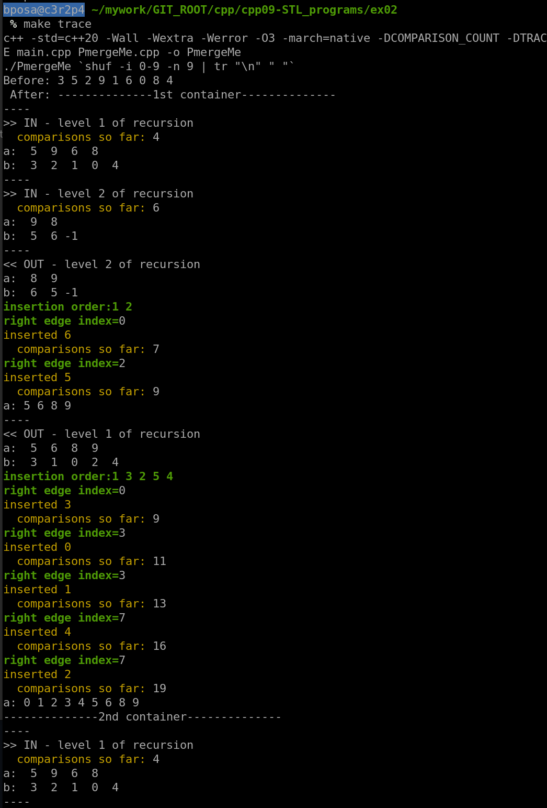
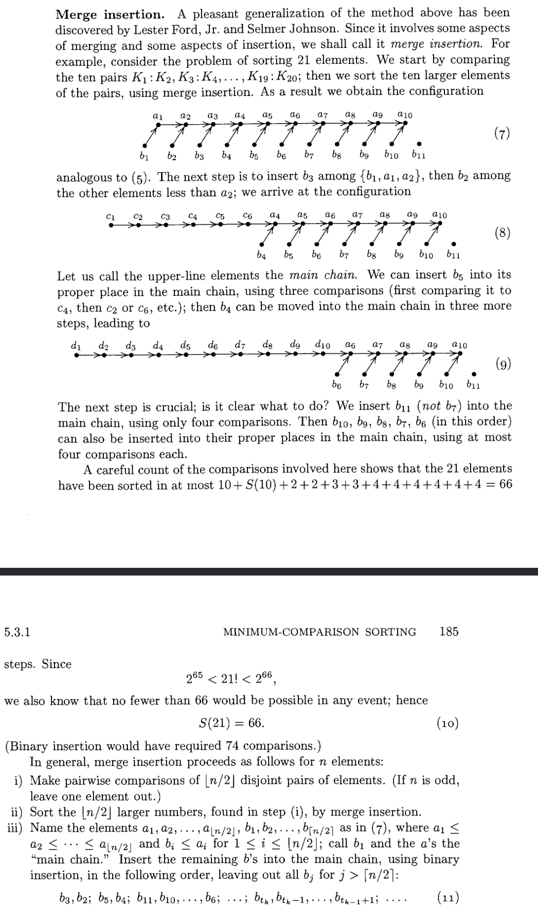

## High Test Coverage

to test with high coverage, run `make` and then the following command:

```./test.sh 1 2 3 4 5 6 | grep "comparisons:" | awk '{print $2}' | sort -n | uniq -c | awk '{print $1 " results with " $2 " comparisons"}'```

The output might take a while depending how many numbers are given. Comparison count should never exceed F(n) values. 





## Step by step

To understand better the flow of the sorting, run `make trace`.
The program works with positive numbers only, and '-1' in the image below represents the lack of a pairless number.




And here is the algorithm description from the source:




## Notes

I understood from [leske42's great guide](https://github.com/leske42/CPP09) that the best use case for this algorithm would be for sorting elements which are expensive to compare, not simple integers. Following that idea, I understood the same elements might be expensive to move, so I decided to only move their pointers and not the data.
